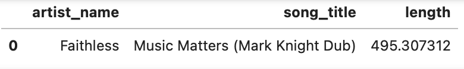
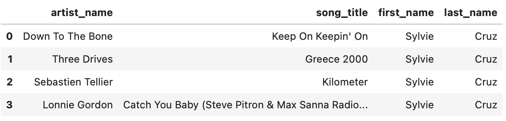
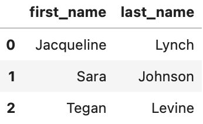

# Sparkify Data Modeling - Cassandra

## Sparkify

Sparkify is a learning project which aims at analyzing collected data from songs and user activity on a music streaming app. Analysts want to understand what songs users are listening to. Currently, they don't have an easy way to query their data, which resides in a directory of JSON logs on user activity on the app, as well as a directory with JSON metadata on the songs in their app.

## Datasets

The dataset provided is event_data from song plays. The directory 'data/event_data' of CSV files partitioned by date. 
Here are examples of filepaths to two files in the dataset:

```
data/event_data/2018-11-08-events.csv
data/event_data/2018-11-09-events.csv
```

The data is processed and stored in a single file `data/event_datafile_new.csv`

## How to run the script

In order to run the scripts you need to have [cassandra](https://cassandra.apache.org/_/download.html) installed on your system. In addition, you need to install its [python lib](https://pypi.org/project/cassandra-driver/) into your virtual environment. 

Use the provided [jupyter notebook](modeling.ipynb) to run the script that creates the data model for the queries provided.

## Example queries

```
>>>> SELECT artist_name, song_title, length FROM session_plays WHERE session_id = 338 AND item_in_session = 4
```



```
>>>> SELECT artist_name, song_title, first_name, last_name FROM user_sessions WHERE user_id = 10 AND session_id = 182
```



```
>>>> SELECT first_name, last_name FROM song_fans WHERE song_title = 'All Hands Against His Own'
```


